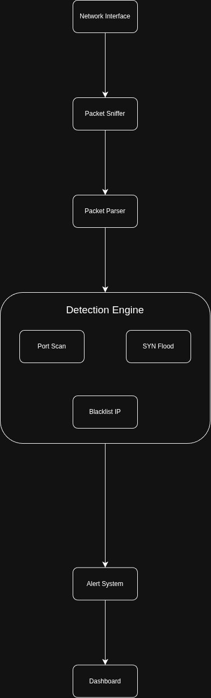

# Mini Network Intrusion Detection System (NIDS)

Real-time packet-based IDS detecting port scans, SYN floods, suspicious IPs. 


## Features
- Live packet sniffing & parsing (Ethernet/IP/TCP/UDP/ICMP)
- Detect: Port scan, SYN flood, blacklist IPs
- CLI dashboard: Stats, alerts real-time
- JSON logging

## Demo

## Quick Start
```bash
git clone https://github.com/ngothoaidev/mini-nids-scapy.git
cd mini-nids-scapy
python3 -m venv .venv
source .venv/bin/activate
pip install -r requirements.txt
```

## Attack Demo (2 terminals)

1) Start NIDS dashboard/sniffer:

sudo python3 main.py --iface lo --bpf "tcp or udp or icmp"

2) In another terminal, run attacks:

python3 demo/attacks.py --attack all --target 127.0.0.1

You should see alerts for port scan, SYN flood, and blacklisted source traffic.

## Tech: 
Python, Scapy

## Web Dashboard (Backend + Frontend)

This project now supports live packet traffic streaming to a React dashboard via WebSocket.

### 1) Install backend deps

```bash
pip install -r requirements.txt
```

### 2) Start backend packet API

```bash
sudo python3 main.py --iface lo --bpf "tcp or udp or icmp" --port 8000
```

Backend endpoints:
- `GET /health`
- `GET /api/stats/overview`
- `GET /api/stats/protocols`
- `GET /api/stats/flows`
- `GET /api/alerts`
- `WS  /ws/live`

### 3) Start frontend dashboard

```bash
cd frontend
npm install
npm run dev
```

Open the URL printed by Vite (default: `http://localhost:5173`).


## Future Plan

nids/
├── src/
│   ├── core/                        # Packet pipeline (your current MVP)
│   │   ├── __init__.py
│   │   ├── sniffer.py               # Scapy capture → queue
│   │   ├── parser.py                # Raw packet → parsed dict
│   │   ├── detection.py             # DetectionEngine (port scan, SYN flood)
│   │   └── stats.py                 # StatsTracker (in-memory counters)
│   │
│   ├── api/                         # FastAPI layer (new)
│   │   ├── __init__.py
│   │   ├── app.py                   # FastAPI app factory
│   │   ├── routes/
│   │   │   ├── alerts.py            # GET /alerts, GET /alerts/{id}
│   │   │   ├── stats.py             # GET /stats/overview, /stats/flows
│   │   │   └── config.py            # CRUD for blacklist, thresholds
│   │   └── ws/
│   │       └── stream.py            # WebSocket /ws/live → real-time push
│   │
│   ├── workers/                     # Async processing (new)
│   │   ├── __init__.py
│   │   ├── pipeline.py              # Queue consumer: parse → detect → log
│   │   └── scheduler.py            # Periodic tasks (cleanup, report gen)
│   │
│   ├── storage/                     # Persistence layer (new)
│   │   ├── __init__.py
│   │   ├── alert_store.py           # MongoDB / SQLite adapter
│   │   ├── models.py                # Pydantic models (Alert, Flow, Stats)
│   │   └── migrations/              # DB schema versions
│   │
│   └── cli/                         # CLI entry points
│       ├── __init__.py
│       ├── main.py                  # Your current main.py (refactored)
│       └── dashboard.py             # Rich live CLI dashboard
│
├── frontend/                        # React / Vue web dashboard (new)
│   ├── src/
│   │   ├── components/
│   │   │   ├── AlertFeed.jsx        # Live alert stream via WebSocket
│   │   │   ├── TrafficChart.jsx     # Protocol distribution (Chart.js)
│   │   │   └── TopFlows.jsx         # Top flows table
│   │   ├── hooks/
│   │   │   └── useWebSocket.js      # WebSocket connection hook
│   │   └── App.jsx
│   ├── package.json
│   └── vite.config.js
│
├── data/
│   ├── blacklist.txt                # Suspicious IPs (one per line)
│   ├── whitelists/
│   │   └── trusted_ips.txt
│   └── alerts/                      # JSONL alert logs (SIEM output)
│       └── .gitkeep
│
├── config/
│   ├── settings.py                  # Pydantic BaseSettings (env-driven)
│   ├── default.yaml                 # Default thresholds & interface config
│   └── .env.example                 # PORT, IFACE, MONGO_URI, LOG_LEVEL
│
├── tests/
│   ├── unit/
│   │   ├── test_parser.py           # Test parse_packet() with mock packets
│   │   ├── test_detection.py        # Test port scan / SYN flood thresholds
│   │   └── test_models.py
│   ├── integration/
│   │   └── test_pipeline.py         # End-to-end: fake packet → alert
│   └── fixtures/
│       └── sample_packets.pcap      # Captured test traffic
│
├── scripts/
│   ├── replay_pcap.py               # Replay .pcap files for testing
│   └── gen_test_traffic.py          # Generate synthetic port scans / SYN floods
│
├── docker/
│   ├── Dockerfile                   # Multi-stage: builder + runtime
│   └── docker-compose.yml           # NIDS + MongoDB + frontend
│
├── docs/
│   └── architecture.md              # System diagram, data flow
│
├── pyproject.toml                   # Project metadata + deps (replaces requirements.txt)
├── .env.example
└── README.md